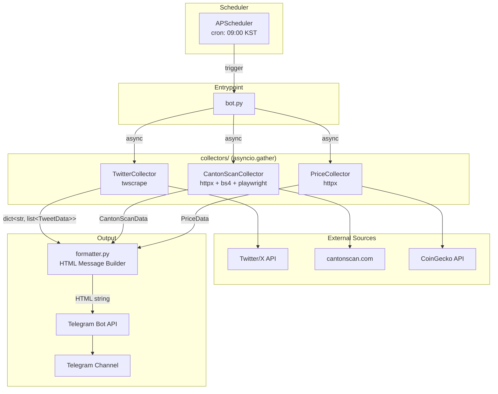

# ARCHITECTURE.md - Canton Telegram Bot

> **Update Trigger**: 새 수집기 추가, 데이터 모델 변경, 의존성 변경 시 이 문서를 갱신할 것.

## 1. System Architecture



### ASCII Diagram (Fallback)

```
                          +------------------+
                          |   APScheduler    |
                          |  cron 09:00 KST  |
                          +--------+---------+
                                   |
                                   v
                          +--------+---------+
                          |     bot.py       |
                          | collect_and_post |
                          +--------+---------+
                                   |
                    +--------------+--------------+
                    |              |              |
                    v              v              v
          +---------+---+ +-------+------+ +-----+--------+
          | Twitter     | | CantonScan   | | Price        |
          | Collector   | | Collector    | | Collector    |
          | (twscrape)  | | (httpx/bs4/  | | (httpx)      |
          |             | |  playwright) | |              |
          +------+------+ +------+-------+ +------+-------+
                 |               |                |
                 v               v                v
           Twitter/X       cantonscan.com    CoinGecko API
                 |               |                |
                 +-------+-------+--------+-------+
                         |
                         v
                  +------+------+
                  | formatter.py |
                  | (HTML build) |
                  +------+-------+
                         |
                         v
                  +------+-------+
                  | Telegram Bot |
                  |   send_msg   |
                  +--------------+
```

## 2. Component Reference

| Component | File | Responsibility | Input | Output |
|-----------|------|---------------|-------|--------|
| Entrypoint / Scheduler | `bot.py` | CLI 파싱, APScheduler cron 등록, 수집-포맷-전송 오케스트레이션 | CLI args (`--now`) | Telegram message sent |
| Config | `config.py` | `.env` 환경변수 로드, 상수 정의 | `.env` file | Module-level constants |
| Twitter Collector | `collectors/twitter_collector.py` | @CantonNetwork, @CantonFdn 최근 24h 트윗 수집 | config (credentials, accounts) | `dict[str, list[TweetData]]` |
| CantonScan Collector | `collectors/cantonscan_collector.py` | cantonscan.com/stats 네트워크 지표 스크래핑 | config (URLs) | `CantonScanData` |
| Price Collector | `collectors/price_collector.py` | CoinGecko에서 $CC 토큰 가격 데이터 수집 | config (coin ID, API key) | `PriceData` |
| Formatter | `formatter.py` | 수집 데이터를 Telegram HTML 메시지로 조합 | TweetData, CantonScanData, PriceData | `str` (HTML) |

## 3. Data Models

```python
@dataclass
class TweetData:
    username: str
    text: str
    created_at: datetime
    url: str
    likes: int = 0
    retweets: int = 0
    replies: int = 0
    media_urls: list = field(default_factory=list)

@dataclass
class CantonScanData:
    daily_burn: Optional[float] = None
    daily_mint: Optional[float] = None
    burn_mint_ratio: Optional[float] = None
    total_burned: Optional[float] = None
    total_supply: Optional[float] = None
    daily_transactions: Optional[int] = None
    daily_active_addresses: Optional[int] = None
    raw_data: dict = field(default_factory=dict)
    fetched: bool = False

@dataclass
class PriceData:
    current_price_usd: Optional[float] = None
    price_change_24h: Optional[float] = None
    price_change_percentage_24h: Optional[float] = None
    high_24h: Optional[float] = None
    low_24h: Optional[float] = None
    market_cap: Optional[float] = None
    total_volume_24h: Optional[float] = None
    circulating_supply: Optional[float] = None
    fetched: bool = False
```

## 4. Data Flow

```
WHEN APScheduler triggers (09:00 KST) OR --now flag passed
  DO bot.py::collect_and_post()

STEP 1: Initialize collectors
  TwitterCollector(), CantonScanCollector(), PriceCollector()

STEP 2: Parallel collection (asyncio.gather, return_exceptions=True)
  Task 1: twitter.collect_all()       -> dict[str, list[TweetData]]
  Task 2: cantonscan.collect()        -> CantonScanData
  Task 3: price.collect()             -> PriceData

STEP 3: Exception handling
  WHEN task result is Exception -> log error, use empty default

STEP 4: Format message
  formatter.build_daily_report(tweets, scan_data, price_data) -> HTML str

STEP 5: Send to Telegram
  WHEN TELEGRAM_BOT_TOKEN is empty -> print preview to stdout
  WHEN TELEGRAM_BOT_TOKEN is set   -> Bot.send_message(HTML, disable_web_page_preview=True)

STEP 6: Cleanup
  cantonscan.close(), price.close()  (httpx client shutdown)
```

## 5. Fallback Strategies

각 수집기는 다단계 폴백을 구현하여 단일 장애 지점을 최소화합니다.

### 5.1 TwitterCollector

| Priority | Strategy | Method | Trigger |
|----------|----------|--------|---------|
| 1 | `user_tweets` | `api.user_tweets(user_id, limit=10)` | Default |
| 2 | `search` | `api.search("from:{username}", limit=10)` | WHEN user_id lookup fails OR user_tweets raises Exception |

Authentication fallback:

| Priority | Method | Condition |
|----------|--------|-----------|
| 1 | Cookie-based | WHEN `TWITTER_COOKIES` is set |
| 2 | Username/Password + login | WHEN cookies empty, credentials present |
| 3 | Skip | WHEN no credentials at all |

### 5.2 CantonScanCollector

| Priority | Strategy | Method | Trigger |
|----------|----------|--------|---------|
| 1 | API endpoints | 6개 후보 URL에 GET 요청, JSON content-type 확인 | Default |
| 2 | HTML parsing | `httpx.get(stats_url)` + BeautifulSoup stat card 패턴 매칭 | WHEN all API endpoints fail |
| 3 | Playwright | Headless Chromium, network response 가로채기 + 렌더링된 HTML 파싱 | WHEN HTML parsing fails |

Playwright 상세:
- Network response interception으로 API endpoint 자동 발견 시도
- 실패 시 렌더링된 DOM에서 `_parse_html()` 재시도
- 최종 실패 시 `page.inner_text("body")` 원문 2000자 저장 (디버깅용)

### 5.3 PriceCollector

| Priority | Strategy | Endpoint | Data Richness |
|----------|----------|----------|---------------|
| 1 | Markets API | `/coins/markets?ids=canton` | Full (price, 24h change, high/low, mcap, volume, supply) |
| 2 | Simple Price API | `/simple/price?ids=canton` | Partial (price, 24h change, mcap, volume) |

## 6. Async Execution Model

```
bot.py::collect_and_post() [single coroutine]
  |
  +-- asyncio.create_task(twitter.collect_all())
  |     |-- collect_recent_tweets("CantonNetwork")  [sequential per account]
  |     |     |-- api.user_tweets() OR _collect_via_search()
  |     |-- asyncio.sleep(2)  [rate limit guard]
  |     |-- collect_recent_tweets("CantonFdn")
  |
  +-- asyncio.create_task(cantonscan.collect())
  |     |-- _try_api_endpoints()  [sequential per endpoint]
  |     |-- _fetch_html() + _parse_html()
  |     |-- _fetch_with_playwright()
  |
  +-- asyncio.create_task(price.collect())
        |-- _fetch_markets_data()
        |-- _fetch_simple_price()

asyncio.gather(task1, task2, task3, return_exceptions=True)
  -> 3개 태스크 병렬 실행, 개별 예외 격리
```

**Key Design Decisions**:

| Decision | Rationale |
|----------|-----------|
| `asyncio.gather` with `return_exceptions=True` | 한 수집기 실패가 다른 수집기를 블로킹하지 않음 |
| Twitter 계정 간 2초 딜레이 | Rate limit 회피 (계정 내부는 순차) |
| CantonScan 폴백은 순차 | 이전 단계 실패 시에만 다음 단계 시도 (불필요한 리소스 소비 방지) |
| `misfire_grace_time=3600` | 시스템 일시 중단 후 최대 1시간 내 재실행 허용 |

## 7. Scheduler

| Setting | Value | Source |
|---------|-------|--------|
| Scheduler | `APScheduler AsyncIOScheduler` | `bot.py::run_scheduler()` |
| Trigger | `cron` | `hour=9, minute=0` (configurable via env) |
| Timezone | `Asia/Seoul` (KST) | `config.TIMEZONE` |
| Misfire Grace | 3600s (1h) | Hardcoded in `bot.py` |
| Immediate Mode | `python bot.py --now` | `asyncio.run(collect_and_post())` |

## 8. Dependency Graph

```
bot.py
  +-- config.py
  |     +-- python-dotenv
  +-- collectors/__init__.py
  |     +-- twitter_collector.py
  |     |     +-- twscrape
  |     |     +-- config.py
  |     +-- cantonscan_collector.py
  |     |     +-- httpx
  |     |     +-- beautifulsoup4
  |     |     +-- playwright (optional, fallback)
  |     |     +-- config.py
  |     +-- price_collector.py
  |           +-- httpx
  |           +-- config.py
  +-- formatter.py
  |     +-- collectors (TweetData, CantonScanData, PriceData)
  |     +-- config.py
  +-- APScheduler
  +-- python-telegram-bot
```

### External Dependencies (requirements.txt)

| Package | Version | Used By |
|---------|---------|---------|
| `python-telegram-bot` | >=21.0 | `bot.py` - Telegram API client |
| `twscrape` | >=0.12 | `twitter_collector.py` - Twitter scraping |
| `httpx` | >=0.25 | `cantonscan_collector.py`, `price_collector.py` - Async HTTP |
| `beautifulsoup4` | >=4.12 | `cantonscan_collector.py` - HTML parsing |
| `python-dotenv` | >=1.0 | `config.py` - .env loading |
| `APScheduler` | >=3.10 | `bot.py` - Cron scheduling |
| `playwright` | >=1.40 | `cantonscan_collector.py` - Headless browser fallback |

### Standard Library Dependencies

| Module | Used By |
|--------|---------|
| `asyncio` | `bot.py`, `twitter_collector.py` |
| `argparse` | `bot.py` |
| `logging` | All modules |
| `dataclasses` | All collectors |
| `datetime`, `zoneinfo` | `bot.py`, `formatter.py`, `twitter_collector.py` |
| `re` | `cantonscan_collector.py`, `bot.py` |

## 9. Environment Variables

| Variable | Required | Default | Description |
|----------|----------|---------|-------------|
| `TELEGRAM_BOT_TOKEN` | Yes (for send) | `""` | Telegram Bot API token |
| `TELEGRAM_CHANNEL_ID` | Yes (for send) | `""` | Target channel ID or @handle |
| `TWITTER_USERNAME` | Yes (for tweets) | `""` | twscrape auth |
| `TWITTER_PASSWORD` | Yes (for tweets) | `""` | twscrape auth |
| `TWITTER_EMAIL` | Yes (for tweets) | `""` | twscrape auth |
| `TWITTER_EMAIL_PASSWORD` | Optional | `""` | IMAP verification |
| `TWITTER_COOKIES` | Optional | `""` | Cookie-based auth (preferred) |
| `COINGECKO_API_KEY` | Optional | `""` | Rate limit relief |
| `SCHEDULE_HOUR` | Optional | `9` | Cron hour (KST) |
| `SCHEDULE_MINUTE` | Optional | `0` | Cron minute |
| `TIMEZONE` | Optional | `Asia/Seoul` | Scheduler timezone |

## 10. Verification

```bash
# 즉시 실행 테스트 (Telegram 토큰 없으면 미리보기 모드)
python bot.py --now

# 의존성 확인
pip install -r requirements.txt
playwright install chromium

# 로그 확인
tail -f bot.log
```

## Change Log

| Date | Change | Reason |
|------|--------|--------|
| 2026-03-31 | Initial creation | docs-init auto-generated |
